<div align="center">

# Foosgoos

**An overhead camera watches the office foosball table, calls the goals, and keeps the ladder.**

Global-shutter vision on a wired local machine · FastAPI event store · React scoreboard

[](https://www.python.org/)
[](https://fastapi.tiangolo.com/)
[](https://opencv.org/)
[](https://docs.ultralytics.com/)
[](https://react.dev/)
[](https://www.typescriptlang.org/)
[](#tested-where-it-counts)

</div>

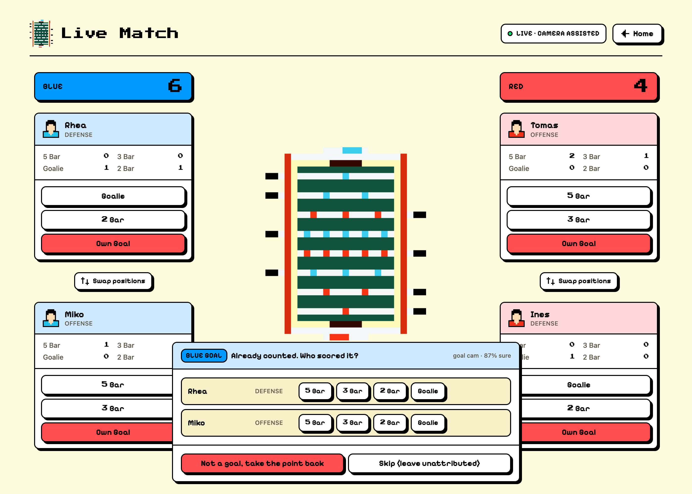

---

Scoring foosball by hand is the reason nobody keeps stats. Someone has to remember
to tap a tablet in the two seconds between a goal and the next serve, and if they
forget, the whole game is fiction.

Foosgoos puts a global-shutter camera above the table and makes the *camera*
responsible for the part humans are worst at: noticing that a point happened.
The camera answers exactly one question, **where is the ball?** Everything about
what counts as a goal is ordinary, testable Python.

---

## The table this is for

Foosgoos is not a demo built against a stock video. It is pointed at one specific
table, in one office, played on hard every day by the people below. The ladder is
the reason anyone wants the camera to work in the first place.

<table>
<tr>
<td width="65%" valign="top">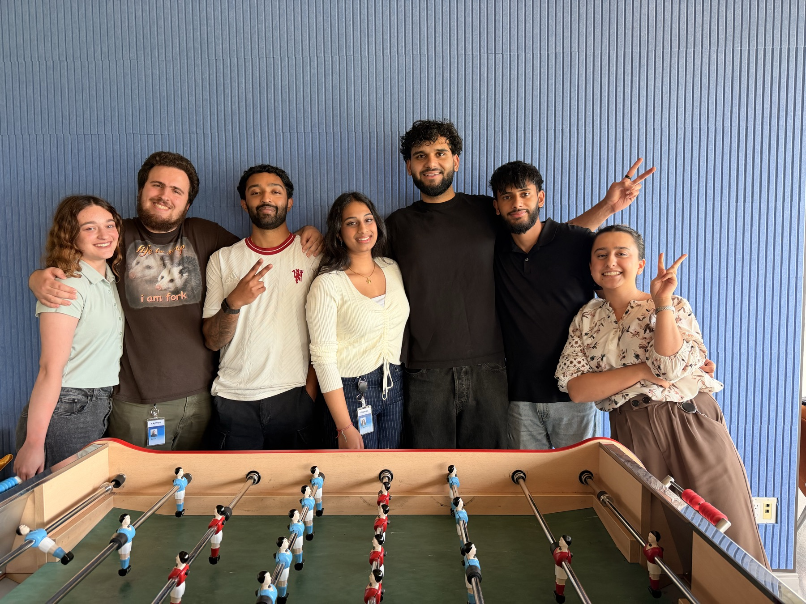</td>
<td width="35%" align="center" valign="top">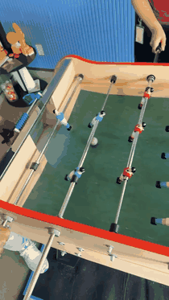<br><sub>An ordinary lunchtime game.<br><a href="docs/assets/random-play.mp4">Full clip</a></sub></td>
</tr>
</table>

---

## What it does

<table>
<tr>
<td width="50%">

**Every goal is a durable, correctable row**

Not a number in React state. A goal has a team, a scorer, a rod, a source
(`manual` or `camera`), a review status, and a millisecond offset into the match
recording. The score is *derived* from that log, so undo, correction and refresh
are all the same operation.

</td>
<td width="50%">

**Assisted mode: the camera proposes, a human confirms**

A detected goal lands on the scoreboard *already counted*, flagged for review with
nobody attributed. One tap says who scored and off which rod. One tap says "not a
goal" and takes the point back.

</td>
</tr>
</table>

<div align="center">
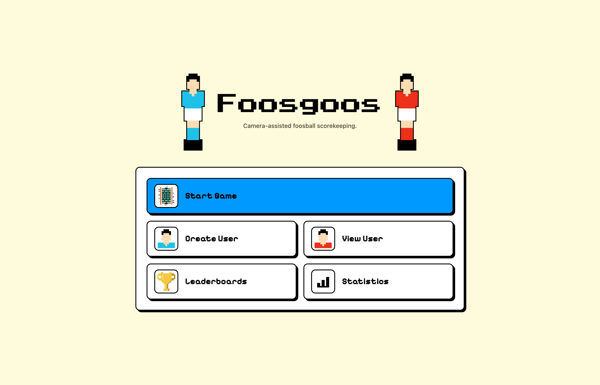
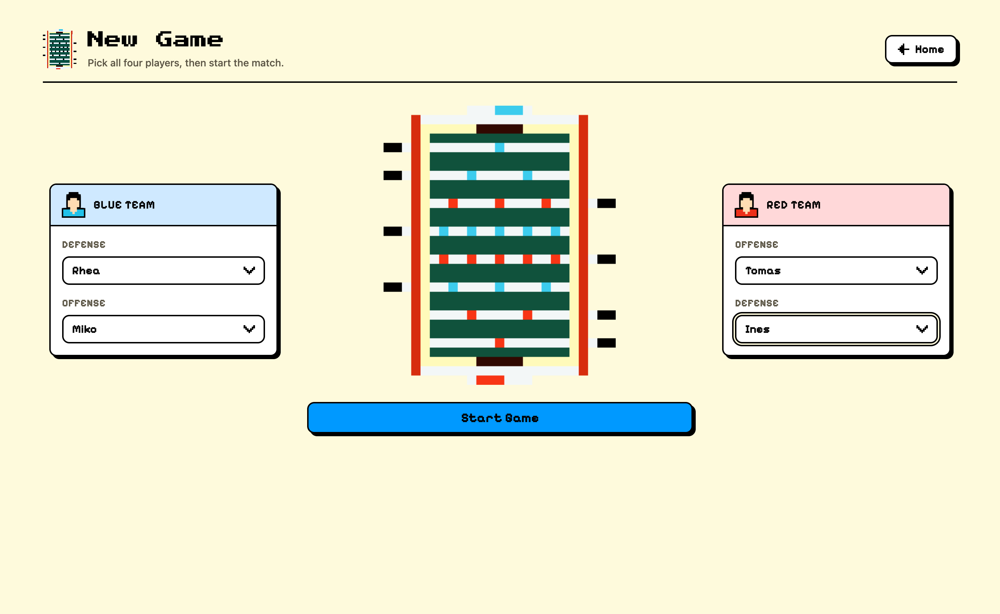
<br>
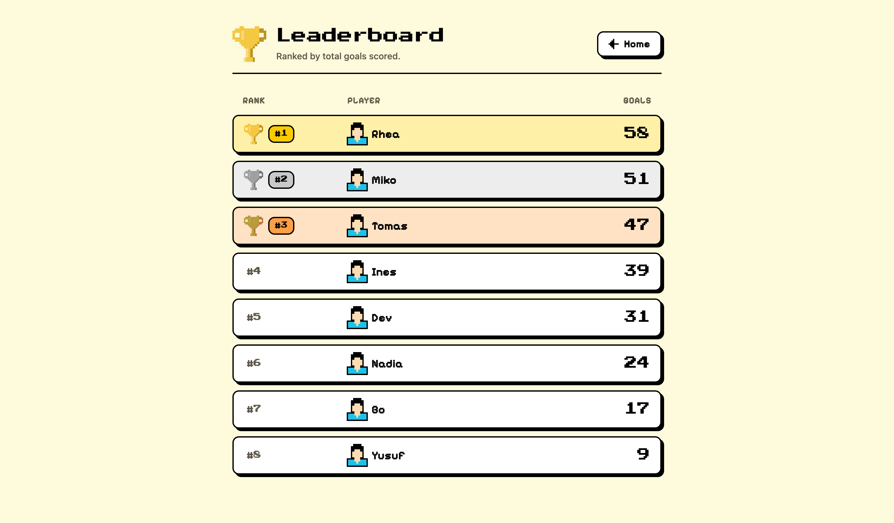
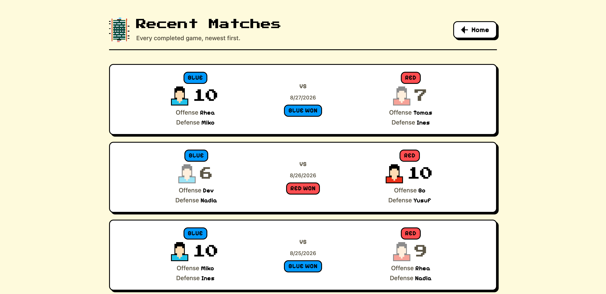
<br>
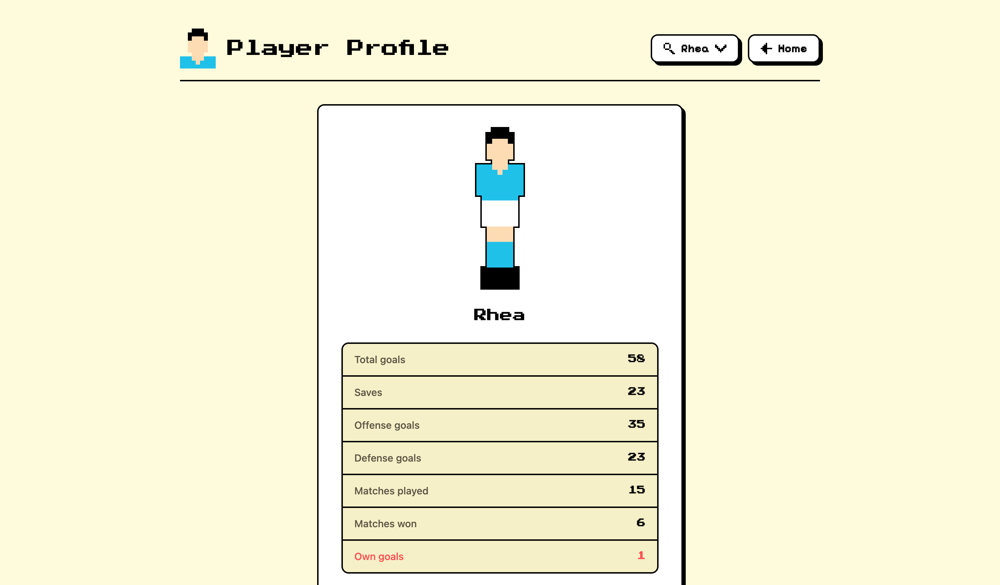
</div>

<sub>Screens are captured against seeded fixture data, so real names and match
history stay out of a public repo.</sub>

---

## The camera half

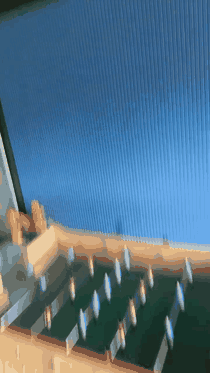

Foosball breaks ordinary webcams. A ball leaves a rod at 30+ mph; a rolling shutter
smears it into a comma, and 30 fps skips it past the goal mouth entirely.

- **ELP AR0234 global shutter**, 1080p @ 90 fps MJPEG. The whole frame exposes at
  once, so the ball stays a crisp circle.
- **Active 32 ft USB extension** with a signal repeater. Passive cable throttles the
  stream to 5 fps; this was found the hard way.
- **Fast shutter (≈7.8 ms) plus dedicated overhead light.** Darkness is fixed with
  photons, never by raising exposure, because a longer exposure smears the ball
  exactly when a goal is being scored.
- **All processing is local and wired.** No cloud, no wifi in the hot path.

Frames are captured on their own thread, and encoding the match recording runs
behind a bounded queue, so a slow disk stalls the recording and never the goal
detection.

<sub>Right: the whole rig in one pan. The camera on the beam, the cable run down
the wall, and the laptop that does every frame of the work.
<a href="docs/assets/camera-showcase.mp4">Full clip</a>.</sub>

<br clear="right">

### From pixels to "that was a goal"

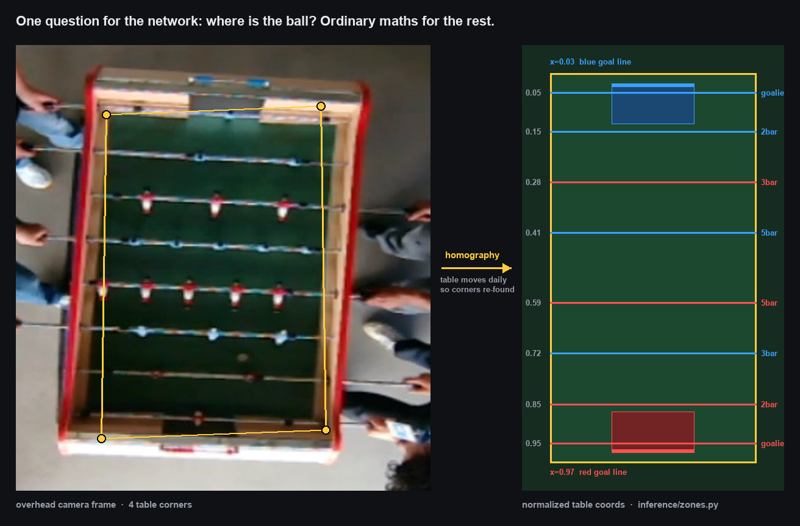

A keypoint model finds the four table corners; a homography maps any pixel into
normalized table coordinates (`x` 0→1 along the length, `y` across the width). From
there the goal logic is arithmetic you can read and test:

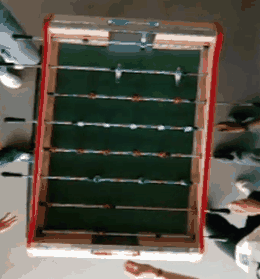

**Two detectors, because one is not enough.** At 90 fps a hard shot moves ~15 cm
between frames, so the ball is frequently *never observed* inside the goal, and
`if x < 0.03` silently misses most real goals.

1. **Crossing.** Intersect the *segment* between two consecutive sightings with the
   goal line, then interpolate where across the width it crossed. Precise; needs two
   sightings.
2. **Disappearance.** The ball was last seen inside the goal mouth and then vanished
   for 0.7 s. Catches what crossing misses.

**A framerate-independent sanity gate.** Detections implying the ball teleported are
almost always a reflection or a red shirt. The limit is expressed in *table-lengths
per second*, so it means the same thing at 90 fps or 15. A 30 mph slam is ~11
lengths/s; the gate sits at 25, roughly 2× headroom over anything physically real.
It compares against the last *accepted* position and the implied speed decays with
time, so a bad reference can suppress a few frames but can never blind the tracker.

**The table is not bolted down.** It gets nudged daily, which quietly invalidates
any fixed calibration, so the corner model re-runs on an interval and a corner
moving more than 20 px is treated as a bump.

**Refusing to guess.** Rod attribution from ball position alone is genuinely
unreliable, because the rods interleave down the table: blue's attacking 3-bar sits
deep in red's half. So the rod hint is **off by default**. In assisted mode a human
supplies it in one tap, and a confidently wrong prefill is worse than no prefill.

<br clear="right">

### Something the model is never catching

<table>
<tr>
<td width="24%" align="center" valign="top">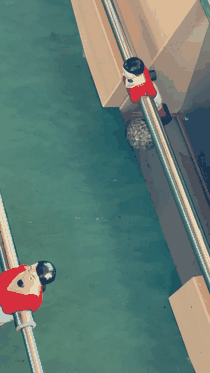<br><sub><a href="docs/assets/insane-play.mp4">Full clip</a>, for the doubters.</sub></td>
<td width="76%" valign="top">

No amount of training will correctly log this shot from Sartaj, and we are fine with it :) 

</td>
</tr>
</table>

---

## How the pieces fit

```
┌────────────────────────┐
│  vision service        │  camera machine: owns the camera and the models
│  ml/vision_service.py  │  polls "is a game running?", records the match,
└───────────┬────────────┘  POSTs a goal when it sees one
            │  HTTP  (idempotent, retried with the same event uuid)
            ▼
┌────────────────────────┐
│  backend (FastAPI)     │  match lifecycle, the goal log, stats rollups
│  backend/              │  the only thing that owns the database
└───────────┬────────────┘
            │  HTTP + websocket
            ▼
┌────────────────────────┐
│  frontend (React + TS) │  the tablet by the table: live score, and one
│  frontend/             │  tap to confirm or correct what the camera saw
└────────────────────────┘
```

`ml/` and `backend/` never import from each other. They share an HTTP contract and
nothing else. The entire vision stack can be swapped out without the API noticing.

### Decisions that earned their place

| Decision | Why |
|---|---|
| Score **derived** from the goal log, never stored | Undo, correction and refresh become one code path. The scoreboard cannot drift from the record. |
| **Idempotency key** on every goal the camera sends | It retries with the same `event_uuid`, so a flaky network cannot score the same point twice. |
| `player_id` is **nullable** | The camera can see a goal without knowing who is responsible. Modelling that honestly is what makes assisted mode possible at all. |
| Match created **before** the first point | It is what tells the camera to start recording, and it gives goals and video a common clock. |
| Video timestamp on every goal | Footage plus the goal log *is* the training and evaluation set. You cannot go back and capture frames you never saved. |
| Match state on the server, not in the tab | A refresh mid-game, or a second device, shows the true score. |
| Class lookup by **name** from the model, never by index | A list that silently disagrees with the exported `data.yaml` would make the tracker follow a player's shirt as if it were the ball. |

### Tested where it counts

```
backend:  23 passed        match lifecycle, the event log, stats rollups
ml:       23 passed        goal geometry, crossing, disappearance, speed gate
```

The goal logic is hand-written maths, not a learned behaviour, which is exactly why
all 23 vision tests run **with no camera, no GPU and no weights** in 0.03 s.

---

## Running it

<details>
<summary><b>Backend</b> · FastAPI + SQLite</summary>

```bash
cd backend
pip install -r requirements.txt
uvicorn app:app --reload          # http://localhost:8000
python -m pytest tests -q         # 23 passed
```

The database migrates itself on startup (`migrations.py`): additive columns only,
no Alembic.
</details>

<details>
<summary><b>Frontend</b> · React 19 + Vite + Tailwind</summary>

```bash
cd frontend
npm install
npm run dev                       # http://localhost:5173
```

Needs `frontend/.env`:

```
VITE_API_URL=http://127.0.0.1:8000
```
</details>

<details>
<summary><b>Vision service</b> · runs on the camera machine</summary>

```bash
cd ml
python -m venv venv && source venv/bin/activate
pip install -r requirements.txt
python -m pytest tests -q         # 23 passed, no camera needed

python -m tools.calibrate_corners # click the four table corners
python -m tools.watch_ball        # read off goal-line coordinates

export FOOSGOOS_API_URL=http://<backend-host>:8000
python -m vision_service --preview
```

It idles until someone starts a game in the app. It will not detect anything until
the ball model is trained. See [`ml/README_ML_PIPELINE.md`](ml/README_ML_PIPELINE.md).
</details>

### Playing a game

1. **New Game.** Pick four players. This creates the match on the server, which is
   what tells the camera to start recording.
2. **Live Match.** Tap goals as usual. With the camera running, detected goals
   arrive already counted and marked for review; tap who scored, or "not a goal".
3. **Finish.** The final score is derived from the goal log and per-player stats
   roll up once.

---

## Repo layout

```
ml/            vision service, goal geometry, training + evaluation harness
  inference/     homography, zones, game state  ← the goal logic, fully tested
  camera/        threaded capture
  training/      Modal training entrypoints for the two models
backend/       FastAPI, SQLAlchemy models, match + goal-event API
frontend/      React tablet UI
docs/assets/   screenshots, figures and clips used above
```
